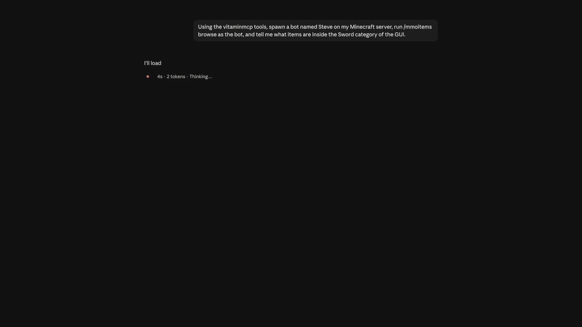

# VitaminMCP

**Test your plugins with an AI agent — on a real running server, with real players.**



[Documentation](https://backas03.github.io/VitaminMCP/) · [Modrinth](https://modrinth.com/plugin/vitaminmcp) · [npm](https://www.npmjs.com/package/vitaminmcp) · [Issues](https://github.com/Backas03/VitaminMCP/issues)

VitaminMCP is a Paper/Purpur plugin that opens an [MCP (Model Context Protocol)](https://modelcontextprotocol.io)
endpoint from inside your running server. Connect an AI agent — Claude Code, Cursor, Codex, Gemini
CLI, any MCP client — and it can drive the server and read back what happened, while real bot
clients join over the actual Minecraft protocol.

**Nothing about the plugin you are testing changes.** No test framework to adopt, no source to
instrument, no mock server: the plugin under test runs on a real server through its real
lifecycle. That also means it works on plugins you did not write — anything installed is testable.

## What the agent can do

- Spawn and control test players — real protocol clients, not mock `Player` objects
- Execute commands as the console or as a player
- Open, read, click and assert on inventories and plugin GUIs
- Right-click NPCs and villagers, the way a shop or quest giver is actually triggered
- Move players, break and use blocks, chat
- Wait for events and conditions instead of sleeping
- Read the player's whole screen: menus, chat, action bar, titles, boss bars, scoreboard
- Read live server state: events, logs, exceptions, permissions
- Drive several servers at once — one session per backend of a BungeeCord network

## MCP tools

| Tool | What it does |
|---|---|
| `session_start` | Connect to a running server; several sessions at once for proxied networks |
| `session_reset` | Disconnect every bot, or close a session |
| `server_info` | Implementation, version, TPS, online players, installed plugins |
| `logs_query` | Search server logs by severity and regular expression |
| `events_summary` | Count captured Bukkit events by type over a time window |
| `events_query` | Read individual captured events, filtered by type and player |
| `exceptions_recent` | Distinct exceptions with counts; full stack trace on demand |
| `state_query` | Live server state — `player` (including permission checks), `block`, `inventory` (the only place a plugin GUI's contents exist), `plugin` (commands, permissions, live config) |
| `command_exec` | Run a command as the console or as any player, permissions and all |
| `wait_for` | Block until a condition holds — `ticks`, `block_is`, `block_is_not`, `event`, `player_online`, `player_offline`, `player_near`, `player_state`, `inventory_open`, `inventory_contains`, `log_matches` |
| `bot_spawn` | Connect an offline or Microsoft-authenticated Minecraft protocol client as a test player |
| `bot_inspect` | Everything the bot's client was sent: chat, action bar, titles, boss bars, scoreboard, health, effects, open menu |
| `bot_run_scenario` | Run a whole scripted test in one call; a failure reports the failing step and what the server was doing at that moment |
| `bot_view` | Live localhost viewer for one bot — the world, or the menu it has open |

### Scenario steps

`bot_run_scenario` scripts a whole test from these steps — a failure reports the failing step and
what the server was doing at that moment:

| Category | Step | What it does |
|---|---|---|
| **World & movement** | `spawn` | Connect the bot and wait until it is standing in the world |
| | `despawn` | Disconnect the bot |
| | `move_to` | Walk there through real physics — pressure plates and move listeners fire; `teleport` mode for setup |
| | `look_at` | Face a block or position |
| | `jump` | Jump |
| | `sneak` | Start or stop sneaking |
| | `sprint` | Start or stop sprinting |
| **Blocks & items** | `break_block` | Break a block, through real digging |
| | `place_block` | Place a block from the hand |
| | `use_block` | Right-click a block — buttons, doors, chests |
| | `hold_item` | Put an item into the main hand |
| | `drop_item` | Drop the held item |
| **Interaction** | `use_entity` | Right-click an entity — the way a shop or quest NPC is actually triggered |
| | `attack_entity` | Attack an entity |
| | `click_slot` | Click a slot in the open menu or GUI |
| | `close_menu` | Close the open menu |
| | `chat` | Send a chat message as the bot |
| | `command` | Send a command as the bot, permissions and all |
| | `console` | Run a console command mid-scenario |
| **Waiting** | `wait_for` | Block until a condition holds — every `wait_for` condition is available as a step |
| **Assertions** | `assert_block` | Assert what a block is |
| | `assert_player` | Assert a player's live state — position, game mode, op, health |
| | `assert_event` | Assert that an event fired on the server |
| | `assert_inventory` | Assert the slots of the open GUI or an inventory |
| | `assert_message` | Assert what the bot's client was told — chat, action bar, title |
| | `assert_reachable` | Assert a position can actually be walked to |

How the three pieces fit together, what every tool and step accepts, and an example scenario are in
[docs/reference.md](docs/reference.md).

## Version support

| Minecraft version | Windows | Linux | macOS | Status |
|---|:---:|:---:|:---:|---|
| 1.18 – 1.20.6 | 🟡 | 🟡 | 🟡 | Planned; below the current agent floor (1.21) |
| **1.21 – 1.21.11** | **🟢** | **🟢** | **🟢** | **Supported and live-tested** |
| **26.1 – 26.1.2** | **🟢** | **🟢** | **🟢** | **Supported and live-tested**; the server needs Java 25 |
| 26.2 and later | 🟡 | 🟡 | 🟡 | Released; each needs a compatibility run before it is added |

#### Runner support by operating system

| Operating system | Node source runner | Native runner asset | Meaning |
|---|:---:|:---:|---|
| **Windows x64** | 🟢 | 🟢 | Published, and the platform the matrix is run on |
| **Linux x64 / arm64** | 🟢 | 🟢 | Published since 3.0.0 |
| **macOS Intel / Apple Silicon** | 🟢 | 🟢 | Published since 3.0.0, ad-hoc signed |

**Legend:** 🟢 supported · 🟡 planned or requires the stated runtime · 🔴 unsupported.

Requirements, where each claim comes from, and how the version matrix is run are in
[docs/reference.md](docs/reference.md#requirements).

## Setup

**1. Install the plugin** — download `VitaminMCP.jar` from the
[latest release](https://github.com/Backas03/VitaminMCP/releases/latest) (or from
[Modrinth](https://modrinth.com/plugin/vitaminmcp)), drop it into `plugins/`, and start the server.

**2. Add the MCP server to your AI client** — it runs on your machine, not on the server:

*Claude Code*

```
claude mcp add vitaminmcp -- npx -y vitaminmcp
```

*Claude Desktop, Cursor, or any client with a JSON MCP config:*

```json
{
  "mcpServers": {
    "vitaminmcp": {
      "command": "npx",
      "args": ["-y", "vitaminmcp"]
    }
  }
}
```

It is also on the [official MCP registry](https://registry.modelcontextprotocol.io) as
`io.github.Backas03/vitaminmcp`, so clients with a registry catalogue can add it from there.

Clients that keep one stdio process per loaded project can instead connect all projects to
[one shared loopback server](INSTALL.md#one-shared-process-for-many-client-sessions). On Windows,
`npx -y vitaminmcp service install` installs and verifies that shared server in one command.

**3. Let the agent wire itself up** — ask it to run the `setup` prompt (in Claude Code:
`/mcp__vitaminmcp__setup`). It finds the running server, checks the plugin, and connects.

That is enough for a server on this machine. The Claude Code plugin (which also brings the testing
skill), other clients, installing from the jars, `config.yml` defaults, bot setup, and reaching a
server behind SSH or TLS are all in [INSTALL.md](INSTALL.md).

Full installation and usage docs: **[backas03.github.io/VitaminMCP](https://backas03.github.io/VitaminMCP/)**
— every tool, scenario runs, multi-server sessions, and remote-server setup are covered in
[docs/usage.md](docs/usage.md).

## Contributing and building

Contribution rules are in [CONTRIBUTING.md](CONTRIBUTING.md), building from source in
[docs/reference.md](docs/reference.md#building-from-source), and release steps in
[docs/publishing.md](docs/publishing.md).

## License

MIT — see [LICENSE](LICENSE). The third-party code bundled in the jars, and its licenses, are
listed in [docs/reference.md](docs/reference.md#license).
